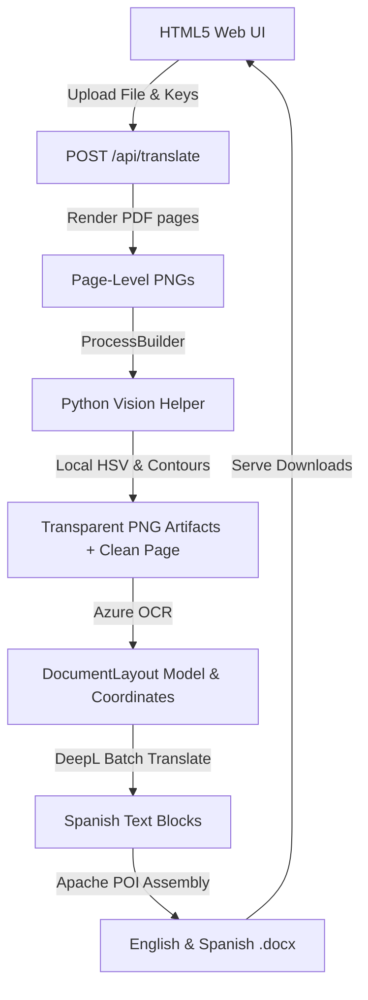

# TaikaTranslator: Document Extraction & Translation Pipeline

An automated, enterprise-grade, high-fidelity **Document Extraction & Translation Pipeline** designed to process scanned PDFs, extract structured layouts (paragraphs and tables), segment complex visual components (colored stamps, seals, and ink signatures), translate the contents from English to Spanish, and generate visually identical `.docx` files.

The pipeline is optimized for production environments processing **100+ documents daily** with zero manual intervention.

---

## 1. System Architecture

The orchestrator utilizes a hybrid, decoupled architecture that exposes a lightweight **Javalin HTTP API** and a modern **HTML5 Web UI** alongside a local **Python 3.12 Vision Helper**:



---

## 2. Core Operational Flow

1. **PDF Rendering:** The Java orchestrator renders scanned multi-page PDFs to high-resolution (300 DPI) PNG files page-by-page using **Apache PDFBox**.
2. **Visual Segmentation (Python Helper):** Runs local OpenCV contour analysis on the rendered page. It isolates and extracts handwritten signatures, verification stamps, and seals as high-fidelity transparent PNGs. It then "whites out" these regions to create a "clean" page image for OCR.
3. **Structured OCR Layout (Azure):** Sends the cleaned page image to **Azure Document Intelligence** (Layout model) to extract precise paragraph geometries, table structures, cell indexes, spans, reading orders, and basic styling. All dimensions are parsed and saved in **normalized coordinates** (floats from `0.0` to `1.0`).
4. **Resilient Translation (DeepL):** Translates all text blocks to Spanish in a single bulk request via **DeepL API**, wrapped in a resilient exponential-backoff retry executor.
5. **High-Fidelity Assembly (Apache POI):** Constructs parallel Word documents:
   * **English DOCX:** Reconstructs the source scanned document page, placing text and tables in their relative spatial boundaries and overlaying transparent PNG stamps/signatures at their exact coordinate layers.
   * **Spanish DOCX:** Reconstructs the translated page, integrating **text-swell scaling** (dynamically scaling font sizes down from 12pt to 9pt and adjusting cell wrapping ratios) to absorb the 15-20% Spanish language expansion without layout breakage.

---

## 3. Installation & Setup

### Prerequisites
* **Java Development Kit (JDK) 17 or 21** (Verify with `java -version`)
* **Python 3.12+** (Verify with `python --version`)
* **Apache Maven 3.9+** (Automatically pre-packaged and available locally)

### Step 1: Clone and Install Python Dependencies
Install the required packages for visual segmentation:
```bash
pip install -r vision/requirements.txt
```

### Step 2: Configure Environment Variables
Copy the `.env.example` template to a local `.env` file in the project root:
```bash
cp .env.example .env
```
Open `.env` and fill in your actual cloud credentials:
```env
# Input/Output paths
INPUT_PDF="samples/scanned_document.pdf"
OUTPUT_DIR="output"

# Python execution path
PYTHON_EXE="C:\\Users\\Nacho\\AppData\\Local\\Programs\\Python\\Python312\\python.exe"

# Azure Document Intelligence Keys
AZURE_ENDPOINT="https://<your-resource>.cognitiveservices.azure.com/"
AZURE_KEY="your_azure_api_key"

# DeepL API Keys
DEEPL_KEY="your_deepl_api_key"
DEEPL_ENDPOINT="https://api-free.deepl.com"
```

> [!TIP]
> **Resilient Self-Healing Stubs:** If no `AZURE_KEY` or `DEEPL_KEY` is provided in `.env`, the pipeline will automatically fall back to mock emulation stubs. This allows you to verify PDF rendering, Python process execution, and Word document assembly immediately without cloud credits.

---

## 4. How to Execute the Application

### Option A: Web Server Mode (Default)
Build the Java orchestrator and start the web server, which serves a premium drag-and-drop web UI on port `8080`:
```powershell
# Compile and package the application as a shaded fat JAR
& "C:\Users\Nacho\AppData\Local\Programs\Maven\apache-maven-3.9.16\bin\mvn.cmd" clean package -DskipTests

# Start the web server
& "C:\Users\Nacho\AppData\Local\Programs\Maven\apache-maven-3.9.16\bin\mvn.cmd" exec:java
```
Once online, open your browser and navigate to **`http://localhost:8080`**.

### Option B: CLI Pipeline Mode (Loads from `.env`)
If you provide `--input` arguments, the orchestrator automatically runs in CLI-only mode, executing the pipeline using `.env` parameters:
```powershell
& "C:\Users\Nacho\AppData\Local\Programs\Maven\apache-maven-3.9.16\bin\mvn.cmd" exec:java `
  -Dexec.args="--input samples/document.pdf --output-dir custom_output"
```

### Option C: Override Configuration via CLI Arguments
You can explicitly override any `.env` parameters by passing flags directly in CLI mode:
```powershell
& "C:\Users\Nacho\AppData\Local\Programs\Maven\apache-maven-3.9.16\bin\mvn.cmd" exec:java `
  -Dexec.args="--input samples/document.pdf --output-dir custom_output --azure-endpoint <url> --azure-key <key> --deepl-key <key>"
```

### Option D: Running via Docker Container
You can build and run the application as a Docker container (incorporating JRE 17, Python 3, PyTorch CPU, and Ultralytics dependencies):
```bash
# Build the Docker image
docker build -t taikatranslator .

# Run the container (binds to http://localhost:8080)
docker run -d -p 8080:8080 taikatranslator
```

---

## 5. Directory Structure

```text
TaikaTranslator/
│
├── .github/workflows/
│   └── deploy.yml                 # CI/CD Action (Builds, Tests, Pushes to Docker Hub)
│
├── .env                           # Local operational configurations (Git ignored)
├── .env.example                   # Configuration template for developers
├── Dockerfile                     # Multi-stage production container setup
├── pom.xml                        # Maven project descriptor (handles shade packaging)
├── README.md                      # Pipeline guide & documentation
│
├── src/
│   ├── main/
│   │   ├── java/com/taikatranslator/
│   │   │   ├── Main.java          # E2E Entrypoint (Launches Server or CLI)
│   │   │   │
│   │   │   ├── core/              # Component Interfaces
│   │   │   │   ├── vision/        # VisionProcessor & VisionResult
│   │   │   │   ├── extractor/     # DocumentExtractor
│   │   │   │   ├── translator/    # TextTranslator
│   │   │   │   ├── assembler/     # WordAssembler
│   │   │   │   └── pipeline/      # TranslationPipeline orchestrator
│   │   │   │
│   │   │   ├── model/             # Geometrical and Styling Models
│   │   │   │   ├── BoundingBox.java
│   │   │   │   ├── TextStyle.java
│   │   │   │   ├── TextBlock.java
│   │   │   │   └── Table.java (Table, TableRow, TableCell)
│   │   │   │
│   │   │   └── infra/             # Core Implementations
│   │   │       ├── http/          # Resilient HttpClientWrapper
│   │   │       ├── retry/         # Resilient RetryExecutor (backoff + jitter)
│   │   │       ├── vision/        # ProcessBuilderVisionProcessor
│   │   │       ├── extractor/     # AzureDocumentExtractor
│   │   │       ├── translator/    # DeepLTranslator
│   │   │       ├── assembler/     # DocxWordAssembler (Apache POI)
│   │   │       └── server/        # TranslationServer (Javalin API)
│   │   │
│   │   └── resources/
│   │       ├── public/
│   │       │   └── index.html     # Premium glassmorphic Web UI
│   │       └── logback.xml        # Structured logging configuration
│   │
│   └── test/                      # Unit & Integration Tests
│
└── vision/                        # Python Vision Helper
    ├── requirements.txt           # Segmenter dependencies
    └── segmenter.py               # SAM-based segmentation CLI
```

---

## 6. HTTP API Documentation

You can interact with the translation orchestrator API directly using curl, Postman, or other HTTP clients.

### A. Translate Document
* **Endpoint:** `POST /api/translate`
* **Content-Type:** `multipart/form-data`
* **Form Parameters:**
  * `file`: The PDF or image file (Required).
  * `azureEndpoint`: Custom Azure endpoint URL (Optional).
  * `azureKey`: Custom Azure API Key (Optional).
  * `deeplKey`: Custom DeepL API Key (Optional).
  * `deeplEndpoint`: Custom DeepL Endpoint URL (Optional).
  * `pythonExe`: Custom Python interpreter path (Optional).

**Example cURL Request:**
```bash
curl -X POST http://localhost:8080/api/translate \
  -F "file=@/path/to/document.pdf"
```

**JSON Response on Success (200 OK):**
```json
{
  "status": "SUCCESS",
  "runId": "a9536e3e-4d5e-5bab-5aa0-dc20ed21263f",
  "originalName": "documento.pdf",
  "englishDownloadUrl": "/api/download?runId=a9536e3e-4d5e-5bab-5aa0-dc20ed21263f&type=reconstructed",
  "spanishDownloadUrl": "/api/download?runId=a9536e3e-4d5e-5bab-5aa0-dc20ed21263f&type=translated"
}
```

### B. Download Translated Document
* **Endpoint:** `GET /api/download`
* **Query Parameters:**
  * `runId`: The unique run identifier returned from the translate response (Required).
  * `type`: The translation version to download, either `translated` (Spanish) or `reconstructed` (English) (Required).

**Example Download Request:**
```bash
# Download Spanish Translated Document
curl -O "http://localhost:8080/api/download?runId=a9536e3e-4d5e-5bab-5aa0-dc20ed21263f&type=translated"
```

---

## 7. Development & Knowledge Graph Management

We use **Graphify** to maintain a persistent, queryable knowledge graph of the codebase AST. 

After refactoring code, modifying classes, or editing interfaces in this repository, run the following command to update the AST graph (which runs 100% locally with zero API cost):

```powershell
# Re-extract and update the knowledge graph
& "C:\Users\Nacho\AppData\Local\Programs\Python\Python312\Scripts\graphify.exe" update .
```
This updates the HTML visualization under `graphify-out/graph.html` and the architectural summary in `graphify-out/GRAPH_REPORT.md` to keep all developer contexts completely aligned.
