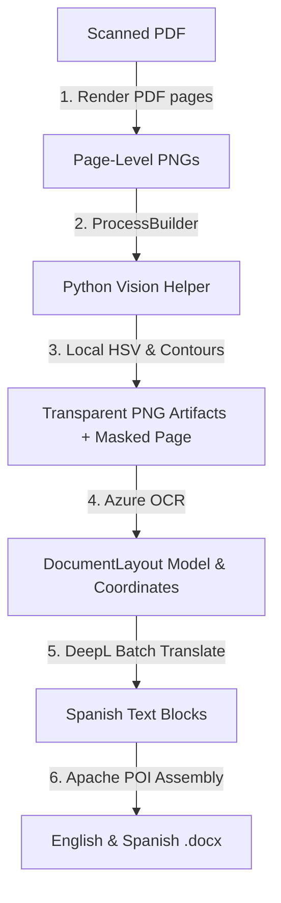

# TaikaTranslator: Document Extraction & Translation Pipeline

An automated, enterprise-grade, high-fidelity **Document Extraction & Translation Pipeline** designed to process scanned PDFs, extract structured layouts (paragraphs and tables), segment complex visual components (colored stamps, seals, and ink signatures), translate the contents from English to Spanish, and generate visually identical `.docx` files.

The pipeline is optimized for production environments processing **100+ documents daily** with zero manual intervention.

---

## 1. System Architecture

The orchestrator utilizes a hybrid, decoupled architecture that pairs a lightweight, fast **Java 17 CLI** application with a local **Python 3.12 Vision Helper**:



---

## 2. Core Operational Flow

1. **PDF Rendering:** The Java orchestrator renders scanned multi-page PDFs to high-resolution (300 DPI) PNG files page-by-page using **Apache PDFBox**.
2. **Visual Segmentation (Python Helper):** Runs local OpenCV contour analysis on the rendered page. It isolates and extracts handwritten signatures, verification stamps, and seals as high-fidelity transparent PNGs. It then "whites out" these regions to create a "clean" page image for OCR.
3. **Structured OCR Layout (Azure):** Sends the cleaned page image to **Azure Document Intelligence** (Layout model) to extract precise paragraph geometries, table structures, cell indexes, spans, reading orders, and basic styling. All dimensions are parsed and saved in **normalized coordinates** (floats from `0.0` to `1.0`).
4. **Resilient Translation (DeepL):** Translates all text blocks to Spanish in a single bulk request via **DeepL API**, wrapped in a resilient exponential-backoff retry executor.
5. **High-Fidelity Assembly (Apache POI):** Constructs parallel Word documents:
   * **English DOCX:** Reconstructs the source scanned document page, placing text and tables in their relative spatial boundaries and overlaying transparent PNG stamps/signatures at their exact coordinate layers.
   * **Spanish DOCX:** Reconstructs the translated page, integrating **text-swell scaling** (dynamically scaling font sizes down from 12pt to 9pt and adjusting cell wrapping ratios) to absorb the 15-20% Spanish language expansion without layout breakage.

---

## 3. Installation & Setup

### Prerequisites
* **Java Development Kit (JDK) 17 or 21** (Verify with `java -version`)
* **Python 3.12+** (Verify with `python --version`)
* **Apache Maven 3.9+** (Automatically pre-packaged and available locally)

### Step 1: Clone and Install Python Dependencies
Install the required packages for visual segmentation:
```bash
pip install -r vision/requirements.txt
```

### Step 2: Configure Environment Variables
Copy the `.env.example` template to a local `.env` file in the project root:
```bash
cp .env.example .env
```
Open `.env` and fill in your actual cloud credentials:
```env
# Input/Output paths
INPUT_PDF="samples/scanned_document.pdf"
OUTPUT_DIR="output"

# Python execution path
PYTHON_EXE="C:\\Users\\Nacho\\AppData\\Local\\Programs\\Python\\Python312\\python.exe"

# Azure Document Intelligence Keys
AZURE_ENDPOINT="https://<your-resource>.cognitiveservices.azure.com/"
AZURE_KEY="your_azure_api_key"

# DeepL API Keys
DEEPL_KEY="your_deepl_api_key"
DEEPL_ENDPOINT="https://api-free.deepl.com"
```

> [!TIP]
> **Resilient Self-Healing Stubs:** If no `AZURE_KEY` or `DEEPL_KEY` is provided in `.env`, the pipeline will automatically fall back to mock emulation stubs. This allows you to verify PDF rendering, Python process execution, and Word document assembly immediately without cloud credits.

---

## 4. How to Execute the Application

### Option A: Standard Build & Execute (Loads from `.env`)
Build the Java orchestrator and run the pipeline using the configured `.env` file parameters:
```powershell
# Compile the project
& "C:\Users\Nacho\AppData\Local\Programs\Maven\apache-maven-3.9.16\bin\mvn.cmd" clean compile

# Execute using .env values
& "C:\Users\Nacho\AppData\Local\Programs\Maven\apache-maven-3.9.16\bin\mvn.cmd" exec:java
```

### Option B: Override Configuration via CLI Arguments
You can explicitly override any `.env` parameters by passing flags directly on execution:
```powershell
& "C:\Users\Nacho\AppData\Local\Programs\Maven\apache-maven-3.9.16\bin\mvn.cmd" exec:java `
  -Dexec.args="--input samples/document.pdf --output-dir custom_output --azure-endpoint <url> --azure-key <key> --deepl-key <key>"
```

---

## 5. Directory Structure

```text
TaikaTranslator/
│
├── .env                           # Local operational configurations (Git ignored)
├── .env.example                   # Configuration template for developers
├── pom.xml                        # Maven project descriptor
├── README.md                      # Pipeline guide & documentation
│
├── src/
│   ├── main/
│   │   ├── java/com/taikatranslator/
│   │   │   ├── Main.java          # E2E Orchestrator CLI entrypoint
│   │   │   │
│   │   │   ├── core/              # Component Interfaces
│   │   │   │   ├── vision/        # VisionProcessor & VisionResult
│   │   │   │   ├── extractor/     # DocumentExtractor
│   │   │   │   ├── translator/    # TextTranslator
│   │   │   │   └── assembler/     # WordAssembler
│   │   │   │
│   │   │   ├── model/             # Geometrical and Styling Models
│   │   │   │   ├── BoundingBox.java
│   │   │   │   ├── TextStyle.java
│   │   │   │   ├── TextBlock.java
│   │   │   │   └── Table.java (Table, TableRow, TableCell)
│   │   │   │
│   │   │   └── infra/             # Core Implementations
│   │   │       ├── http/          # Resilient HttpClientWrapper
│   │   │       ├── retry/         # Resilient RetryExecutor (backoff + jitter)
│   │   │       ├── vision/        # ProcessBuilderVisionProcessor
│   │   │       ├── extractor/     # AzureDocumentExtractor
│   │   │       ├── translator/    # DeepLTranslator
│   │   │       └── assembler/     # DocxWordAssembler (Apache POI)
│   │   │
│   │   └── resources/
│   │       └── logback.xml        # Structured logging configuration
│   │
│   └── test/                      # Unit & Integration Tests
│
└── vision/                        # Python Vision Helper
    ├── requirements.txt           # Segmenter dependencies
    └── segmenter.py               # Local contour segmentation CLI
```

---

## 6. Development & Knowledge Graph Management

We use **Graphify** to maintain a persistent, queryable knowledge graph of the codebase AST. 

After refactoring code, modifying classes, or editing interfaces in this repository, run the following command to update the AST graph (which runs 100% locally with zero API cost):

```powershell
# Re-extract and update the knowledge graph
& "C:\Users\Nacho\AppData\Local\Programs\Python\Python312\Scripts\graphify.exe" update .
```
This updates the HTML visualization under `graphify-out/graph.html` and the architectural summary in `graphify-out/GRAPH_REPORT.md` to keep all developer contexts completely aligned.
