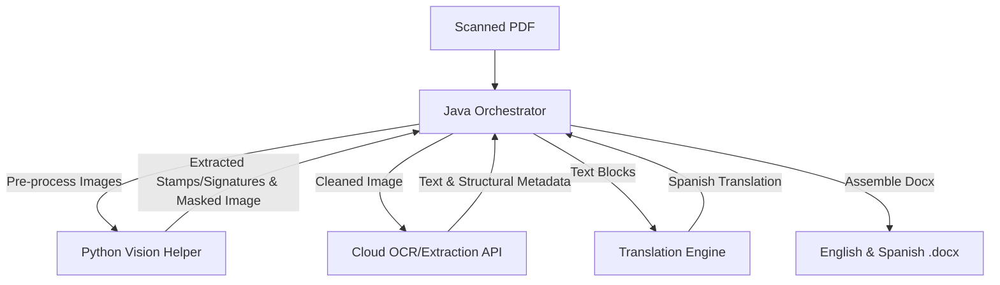

# Constitution: Document Extraction & Translation Pipeline (TaikaTranslator)

This constitution defines the core principles, strict technology stack, architectural constraints, and development guidelines for the automated Document Extraction & Translation Pipeline. Every component and contribution to this codebase must adhere strictly to these principles.

---

## 1. Core Principles

- **Zero Manual Intervention:** The pipeline operates fully automated, processing 100+ scanned documents daily from end to end without human gatekeeping.
- **Visual & Layout Fidelity:** The target outputs must be layout-preserving `.docx` documents. The structure, fonts, alignments, stamps, signatures, and visual artifacts from the source PDF must be faithfully mapped to the generated files.
- **Bilingual Reconstructive Pipeline:** The process generates two parallel artifacts for every input document:
  1. An **English `.docx`** (faithfully reconstructing the scanned source).
  2. A **Spanish `.docx`** (faithfully translating and reconstructing the scanned source).
- **Production-Grade Reliability:** Functions must be idempotent, scalable, resilient to API failures (employing self-healing/retry patterns), and strictly structured in execution tracking.

---

## 2. Technology Stack & Component Boundaries

### A. Core Orchestrator (Java)
- **Runtime:** Java 17 or 21.
- **Build System:** Apache Maven.
- **Frameworks:** Pure Java Command-Line Interface (CLI). **Strictly no Spring Boot** or heavyweight container systems to ensure low memory foot-print, fast startup, and efficient command-line execution in batch/scheduled worker environments.
- **Libraries:** Apache POI or docx4j for building the final Office Open XML (`.docx`) file from scratch.
- **Architecture:** Dependency Injection (DI) principles using pure Java structural patterns (Service Locators / Factory patterns) to keep modules decoupled.

### B. Vision Helper (Python)
- **Runtime:** Python 3.10+.
- **Responsibility:** Isolating, masking, and extracting complex visual elements (such as signatures, stamps, seals, logos, and handwritten text overlap) from document pages.
- **Models:** Segment Anything Model 3 (SAM 3) or YOLOv11 to perform precise contoured segmentation and extraction of biomechanical and corporate visual markers.
- **Pre-processing Output:** High-resolution transparent PNG cutouts of visual elements and a "cleaned" version of the source pages with visual elements masked out, ready for optimal OCR reading.

### C. Structured Extraction (Cloud API)
- **APIs:** Azure Document Intelligence (Layout/Read models) or Google Cloud Document AI.
- **Responsibility:** Extracting textual content, paragraph classifications, font styles, tables, lists, and raw coordinate-based bounding boxes from the cleaned document pages.

### D. Translation Engine
- **APIs:** DeepL API, Claude (Anthropic), or GPT-4o (OpenAI).
- **Responsibility:** Executing accurate English-to-Spanish translation on structural text blocks, maintaining technical vocabulary, and mapping translations back to original spatial elements.

---

## 3. Strict Architectural Rules (.cursorrules baseline)

### A. Dynamic Layouts (No Hardcoding)
- **Rule:** Under no circumstances should coordinates, margins, font sizes, or alignments be hardcoded to static values based on individual page designs.
- **Implementation:** All element placements, bounding boxes, table structures, and dimensions must be dynamically computed and normalized relative to the page dimensions returned by the Cloud Extraction API.

### B. Idempotency & Scalability
- **Rule:** Every stage of the pipeline must be designed to safely restart after a failure without duplicating work or generating corrupt artifacts.
- **Implementation:**
  - Standardized stage checkpoints with structured intermediate outputs stored locally or in object storage (e.g., source pages, vision outputs, OCR JSONs, translation mappings).
  - Explicit idempotency keys for tracking running and completed batch executions.

### C. Resilient API Integrations (Retry Pattern)
- **Rule:** Third-party cloud calls (Azure, Google Cloud, DeepL, OpenAI/Anthropic) must be wrapped in self-healing wrappers.
- **Implementation:** Implementing exponential backoff with jitter and configurable maximum retry policies (Retry Pattern) to mitigate transient network errors or rate-limiting.

### D. Text Swell Mitigation
- **Rule:** The system must gracefully accommodate Spanish translation strings that are typically 15% to 20% longer than their English counterparts.
- **Implementation:**
  - Dynamic font-scaling logic for constrained text regions.
  - Column-width auto-sizing based on bounding-box proportions.
  - Flexible cell/paragraph wrapping to prevent overlapping elements or single-character orphans in the output word document.

### E. Explicit & Decoupled Modularity
- **Rule:** Rely on clean abstractions and Interfaces.
- **Implementation:** Core orchestration logic must interact with APIs via generic interfaces (e.g., `DocumentExtractor`, `TextTranslator`, `VisionProcessor`, `WordAssembler`). This allows swapping deep learning models or cloud providers by editing configuration without modifying the workflow coordination.

### F. Structured Logging
- **Rule:** Standardized logging across the system using SLF4J (with Logback or Log4j2 in Java) and Python `logging`.
- **Implementation:** Logging must utilize structured formats (JSON or standardized prefixing) containing unique execution IDs, component scopes, and execution times, ensuring simple ingestion for monitoring dashboards.
