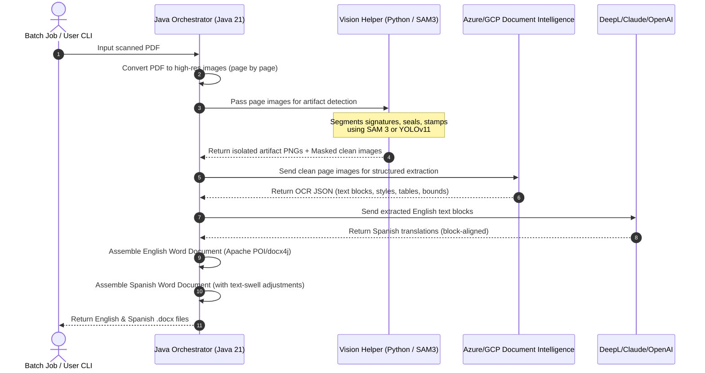

# System Specification: Document Extraction & Translation Pipeline (TaikaTranslator)

This specification defines the functional, non-functional, input, and output requirements for the automated high-fidelity Document Extraction & Translation Pipeline.

---

## 1. Input Specifications

The pipeline must accept documents meeting the following criteria:

- **Format:** Scanned or rasterized PDF files (`.pdf`).
- **Resolution:** Dynamic, typically 150 to 300+ DPI.
- **Complex Visual Content:**
  - Standard text paragraphs (variable fonts, sizes, weights, alignments).
  - Multi-column structures, headers, and footers.
  - Data tables with explicit/implicit cell borders.
  - Signatures (biomechanical overlays).
  - Verification stamps (color overlays, circular, rectangular, or irregular seals).
  - Official stamps (overlapping text blocks).
- **Language:** Source text is primarily in **English** (with potential handwritten variations).

---

## 2. Output Specifications

For every processed input PDF, the system must output exactly two artifacts:

1. **English Reconstruction (`[original_name]_reconstructed.docx`):**
   - A fully editable `.docx` file containing the extracted text.
   - Text visual styling (font family, weight, style, size, color) matched as closely as possible to the scanned original.
   - Original layouts preserved (alignment, line spacing, margins, column-based flows).
   - Signatures, stamps, and seals isolated, cleaned of backgrounds, and embedded as high-fidelity floating or inline graphics at their exact relative positions.
   
2. **Spanish Translation (`[original_name]_translated.docx`):**
   - A fully editable `.docx` file containing the translated text.
   - The translation is from English to Spanish.
   - Preserves all structural metadata, font styles, colors, alignments, and background-cleaned visual elements.
   - Accounts for Spanish **text expansion** (~15-20% longer string lengths) by dynamically adjusting dimensions, scaling fonts, or flowing text to prevent visual overlaps, layout breakage, or line clipping.

---

## 3. Core Functional Requirements

### F1. PDF Processing & Page Extraction
- The system must convert multi-page scanned PDFs into separate high-resolution page images (PNG/JPEG, minimum 300 DPI) to facilitate visual isolation and OCR processing.

### F2. Biomechanical & Visual Element Segmentation (Vision Helper)
- **Model-Driven Masking:** Use SAM 3 or YOLOv11 to dynamically identify, segment, and mask visual artifacts (signatures, stamps, company seals, official stamps) from each page image.
- **Image Cleaning:**
  - Produce an output page image where segmented elements are cleanly masked (erased to white/background color) to ensure the OCR engine is not confused by overlapping handwritten or stamped markings.
  - Extract each identified artifact as a separate transparent PNG, cropped precisely to the contoured boundary.

### F3. Structured Layout & Font Analysis (Cloud OCR)
- Analyze cleaned images using Azure Document Intelligence or GCP Document AI to extract:
  - Paragraph blocks with precise bounding-box coordinates `(top, left, width, height)` relative to the page.
  - Table structures, including rows, columns, cell spans, and relative positioning.
  - Font characteristics (e.g., Arial, Times New Roman, bold, italic, font size, text color).
  - Reading order of text blocks.

### F4. Block-Level Semantic Translation
- Group and send English text segments to the Translation Engine.
- Keep structural tagging intact (e.g., bullet lists, table cells, paragraph boundaries) so that translations can be perfectly mapped back to the respective structural element blocks.
- Preserve original formatting markdown or structural mappings.

### F5. High-Fidelity Word (.docx) Generation
- The Orchestrator must dynamically construct a `.docx` document using Apache POI or docx4j.
- Layout reconstruction methods:
  - **Option A (Flow-based Layout):** Generating standard paragraphs and tables with dynamic margins, line heights, and indents mapped from coordinates, with images placed inline.
  - **Option B (Absolute Box Layout):** Placing text boxes with absolute positioning (using drawing elements or text fields) matching the exact dimensions and scale of the scanned PDF pages.
- Visual elements (stamps, signatures) must be overlaid as floating pictures on top of the text/tables in their exact normalized coordinate positions.

### F6. Advanced Text Swell Adjustments (Spanish Output)
- To handle the 15-20% length expansion of Spanish text:
  - **Dynamic Scaling:** Reduce font sizes incrementally (e.g., from 11pt to 9.5pt) for bounded elements (like tables or absolute text boxes) if the translated text exceeds the physical boundaries.
  - **Adaptive Widths:** Expand table column widths dynamically based on character length calculations, readjusting adjacent columns proportionally.
  - **Layout Reflow:** Let pages reflow naturally where acceptable, but enforce strict boundaries for signature lines and headers/footers to prevent clipping.

---

## 4. Non-Functional & Operational Requirements

### NF1. Throughput & Scalability
- The CLI must be fully optimized for batch-processing. It should easily handle the processing of **100+ documents daily**.
- Concurrency: Processing steps (such as calling translation and extraction APIs, and running the Python helper) should support multi-threading for page-level tasks.

### NF2. Security & Compliance
- Document data should be processed in memory or securely stored in localized temporary folders inside the workspace. No remote data leakage except to the configured API endpoints (Azure, DeepL, etc.).
- Secure credential management: API keys, endpoints, and credentials must be injected dynamically via environment variables or a secure configuration file (e.g., `application.properties` or `.env`).

### NF3. Reliability (Robust Error & Rate-Limit Recovery)
- **Retry Mechanism:** All external HTTP API requests (Azure, GCP, DeepL, OpenAI) must implement a robust Retry Pattern:
  - Maximum retries: 5.
  - Initial delay: 1000ms.
  - Exponential backoff factor: 2.0 with random jitter to prevent thundering herd problems.
- **Fail-Safe Fallbacks:** If the Python Vision Helper fails to load or segment stamps on a page, the orchestrator should gracefully fall back to full-page OCR without stamp masking, logging a detailed warning.

### NF4. Detailed Logging & Auditing
- Maintain a structured log stream with unique trace IDs (`UUID`) for each document run.
- Log levels: `INFO` for progress tracking, `WARN` for recoverable errors (e.g. retries, model fallbacks), `ERROR` for workflow failures, `DEBUG` for bounding box calculations and raw API payloads.
