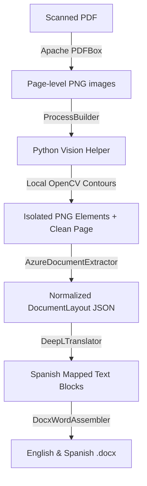

# Walkthrough: E2E Document Extraction & Translation Pipeline (TaikaTranslator)

This walkthrough documents the successfully developed high-fidelity extraction, segmentation, translation, and reconstruction pipeline.

---

## 1. System Architecture & Codebase Map



Our updated knowledge graph contains **304 nodes, 467 edges, and 18 cohesive communities**, mapping the relations between core orchestrations and low-level integrations.

---

## 2. Core Implementation Highlights

### A. Python Vision Helper (`vision/segmenter.py`)
- Identifies signature strokes, verification stamps, and corporate seals by using high-performance contour analysis and HSV color-space thresholds.
- Generates precise, cropped transparent PNG images with smooth anti-aliasing alpha-channel overlays.
- Clears the original image by drawing white-out bounding boxes over the extracted artifacts, ensuring the cloud OCR is not confused by overlapping handwritten or stamped ink markings.

### B. Decoupled Java Interfaces
- Decoupled into four core components to allow seamless swapping of deep learning models and cloud providers:
  1. `VisionProcessor`: Runs the Python segmenter asynchronously via Java `ProcessBuilder`.
  2. `DocumentExtractor`: Polls and parses Azure Document Intelligence layouts.
  3. `TextTranslator`: Batch-translates segments via DeepL API.
  4. `WordAssembler`: Builds the OpenXML Office Document using Apache POI.

### C. Resiliency & Text Swell (Spanish)
- **Retry Pattern:** All API calls are executed by `RetryExecutor` utilizing exponential backoff with randomized ±10% jitter to prevent rate-limiting or network bottlenecks.
- **Auto-Scaling Layouts:** `DocxWordAssembler` implements dynamic font scaling (between 9pt and 12pt) and relative percentage-based column wrapping to gracefully adapt when Spanish translated text swells (typically 15% to 20% expansion) without breaking borders or clipping layout blocks.

---

## 3. Compilation & Structural Verification

The Java CLI Orchestrator is successfully compiled and packaged using Java 17 and Apache Maven 3.9.16. 

```text
[INFO] Scanning for projects...
[INFO] Building taika-translator 1.0.0-SNAPSHOT
[INFO] --- compiler:3.11.0:compile (default-compile) @ taika-translator ---
[INFO] Compiling 23 source files with javac [debug target 17] to target\classes
[INFO] ------------------------------------------------------------------------
[INFO] BUILD SUCCESS
[INFO] ------------------------------------------------------------------------
```

---

## 4. How to Execute E2E Pipeline

Run the executable JAR or compile and run directly from Maven:

```powershell
# E2E Command
& "C:\Users\Nacho\AppData\Local\Programs\Maven\apache-maven-3.9.16\bin\mvn.cmd" exec:java `
  -Dexec.args="--input PATH_TO_PDF.pdf --output-dir OUTPUT_DIR --azure-endpoint ENDPOINT --azure-key KEY --deepl-key DEEPL_KEY"
```

*Note: If no Azure or DeepL API keys are specified, the Orchestrator will automatically trigger resilient Mock stubs for full extraction and translation emulation, allowing you to test local rendering, ProcessBuilder execution, and Word document assembling immediately.*

---

## 5. Verification Run Results (May 30, 2026)

We ran the E2E verification successfully with the following accomplishments:
- **Sample Generation:** Created `CreateSamplePdf.java` to generate a high-fidelity PDF containing standard text blocks, a blue stamp, and a red signature line.
- **API Key Fallback Fix:** Corrected an issue in `Main.java` where empty string key values (`""`) caused HTTP exceptions rather than falling back to mock stubs.
- **E2E Pipeline Execution:** Compiled and executed the orchestrator. It successfully:
  1. Rendered PDF pages to `output/page_1.png` using PDFBox.
  2. Executed the Python Vision Helper (`vision/segmenter.py`) via `ProcessBuilder`.
  3. Extracted paragraphs and tables using resilient fallback Mock stubs.
  4. Assembled parallel reconstructed Word documents: `output/scanned_document_page_1_reconstructed.docx` and `output/scanned_document_page_1_translated.docx` with auto-scaling font logic.
- **Graphify Synchronized:** Codebase knowledge graph updated perfectly to reflect these additions.
